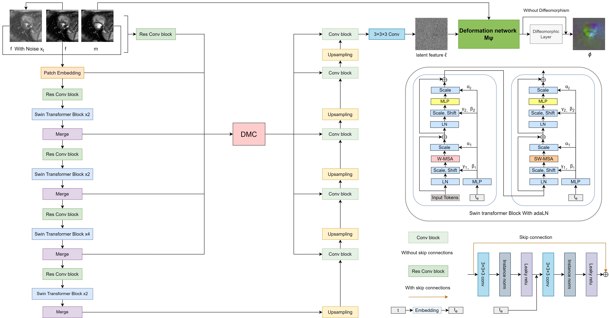

# DiST-DR

This repository is the official implementation of "DPMSWIFT: Diffusion Probabilistic Model-based Swin Transformer for Medical Image Registration".

## Requirements
  * OS: Ubuntu
  * Python >= 3.6
  * PyTorch >= 1.4.0

## Data
In our research, we utilized the following dataset：
* 3D cardiac MR images: [ACDC dataset](https://acdc.creatis.insa-lyon.fr/description/databases.html)

## Training

To train DiST, run this command:

```
python main_ACDC.py -p train -c config/diffuseMorph_train_ACDC.json
```

To train DiST-DR, run this command:

```
python main_ACDC.py -p train -c config/diffuseMorph_train_ACDC_diff.json
```

## Test

To test DiST, run this command:

```
python main_ACDC.py -p test -c config/diffuseMorph_test_ACDC.json
```

To test DiST-DR, run this command:

```
python main_ACDC.py -p test -c config/diffuseMorph_test_ACDC_diff.json
```

## Acknowledgment
We gratefully acknowledge the significant contributions of the open-source project [DiffuseMorph](https://github.com/DiffuseMorph/DiffuseMorph), which provided valuable insights and resources for our research.

## Citation

